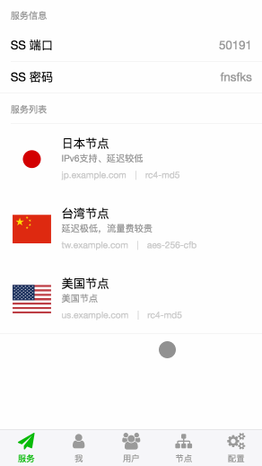

### 项目状态

###### Master

[](https://travis-ci.org/qious/ss-panel)
[](https://coveralls.io/github/qious/ss-panel?branch=master)


###### Develop

[](https://travis-ci.org/qious/ss-panel)
[](https://coveralls.io/github/qious/ss-panel?branch=develop)

### 项目介绍

##### 用途

> 使用 微信企业号/企业微信 管理 shadowsocks 用户

##### 注意

> 本项目只是管理界面及控制中心，各科学上网节点需要运行下述程序中的任意一种

* [shadowsocks](https://github.com/qious/shadowsocks) : 基于 Python 版本修改而来
* [ss-adapter](https://github.com/qious/ss-adapter) : shadowsocks udp 控制协议适配器

##### 依赖

* Node.js >= 7.6.0
* MySQL
* Redis

##### 特性

* 基于微信企业号/企业微信授权登录
* 新用户授权登录自动分配帐号信息
* 节点异常时会通过 微信企业号/企业微信 发送消息给管理员
* 数据库自动配置、自动升级（v0.5.0之后）
* 前后端分离，完善的swagger接口文档（项目运行后浏览器访问 /doc 路径），方便二次开发
* ...

##### 演示



#### 常规运行

##### 下载或clone代码到任意目录

```bash
git clone https://github.com/qious/ss-panel.git
```

##### 安装依赖

```bash
cd /path/to/ss-panel/server
npm i
sudo npm i -g pm2
```

##### 复制并修改配置文件

```bash
cd /path/to/ss-panel/server
cp ./config/default.js ./config/local.js
vim ./config/local.js # 根据自身需要修改配置文件
```

##### 测试运行

```bash
cd /path/to/ss-panel/server
npm run dev # 如无报错后可进入下一步
```

##### 正式运行

```bash
cd /path/to/ss-panel/server
npm run pm2.start
```

### 更新升级

##### 更新代码

```bash
cd /path/to/ss-panel
git pull
```

##### 重启服务

```bash
cd /path/to/ss-panel/server
npm run pm2.reload
```

### 进阶配置

##### 使用 Nginx 处理静态资源，Nginx示例配置如下

```nginx
upstream ss-panel {
    server 127.0.0.1:8000;
}

server {
    listen 80;
    server_name ss.example.com;

    root /path/to/ss-panel/client/dist;
    index index.htm index.html;

    location /api {
        include proxy_params;
        proxy_pass http://ss-panel/api;
    }

    # 根据需要取消注释
    # location /doc {
    #     include proxy_params;
    #     proxy_pass http://ss-panel/doc;
    # }

    location /static {
        expires 7d;
    }
}
```